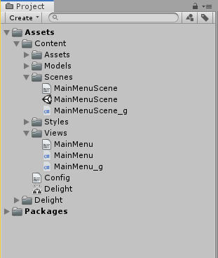

# Creating a Main Menu

1. TOC
{:toc}

## Introduction

This tutorial serves as a practical introduction to the framework by showing you how to create a main menu. Be sure to also check out the [Quick Start](Quick Start.html)  guide on how to get started and the [Basic Overview](Basic Overview.html) to get a conceptual overview of the framework. 


## Creating the MainMenu scene

We'll start by creating a Main Menu scene. Right-click in your project hierarchy and choose `Create -> Delight Scene`. Give it the name `MainMenuScene` and press enter.

Open the scene `MainMenuScene.xml` and add a `MainMenu` view to it:

*MainMenuScene.xml*

```xml
<MainMenuScene xmlns="Delight" xmlns:xsi="http://www.w3.org/2001/XMLSchema-instance" xsi:schemaLocation="Delight ../Delight.xsd">
    <MainMenu />    
</MainMenuScene>
```

You've now created a scene that is set up to display a single view, the `MainMenu`. The framework sees that the view `MainMenu` doesn't exist and will automatically generate it for you. You now should have the following files in your project:



{{Note you can also manually create new views by choosing `Create -> Delight View` }}

You can now open `MainMenuScene.unity` which you can run throughout the tutorial to see the main menu taking shape.

{{All content files, like the XML files MainMenuScene.xml and MainMenu.xml are automatically processed by the framework as they are changed (if the editor is open). To manually tell the framework to process all content, press the "Reload All" button in the Delight window (Window -> Delight). Also note that files with the "_g" postfix are generated (and overwritten) when the XML files are processed. }}


## Creating the Main Menu view

Open the `MainMenu` view and edit it so it contains the following:

*MainMenu.xml*

   ```xml
<MainMenu xmlns="Delight" xmlns:xsi="http://www.w3.org/2001/XMLSchema-instance" 
          xsi:schemaLocation="Delight ../Delight.xsd">
  <Group Spacing="10">
    <Button Text="Play" />
    <Button Text="Options" />
    <Button Text="Quit" />
  </Group>
</MainMenu>
   ```

The name of the root tag `<MainMenu>` is the name we've given the view. The view contains three [Button](link-to-button-api) views that are arranged vertically by a [Group](link-to-group-api) view. The [API docs](api-docs-link) contains detailed information about all the 40+ views included in the framework.

`Spacing="10"` and `Text="Play"` are [dependency properties](link-to-dependency-properties-in-overview) that changes the layout and behavior of the  view. E.g. `Spacing="10"` tells the `Group` view to insert a spacing of 10 pixels between the buttons.

Different views have different properties but most views are based on the `UIView` which has the following properties that are used to do layout:

| Dependency Property | Description                                                  |
| ------------------- | ------------------------------------------------------------ |
| Width               | Width of the view that can be specified in pixels "10" or percentage "100%". Some views are 100% by default (which means they take up the extent of their parent). The Group adjusts its size to its children by default. |
| Height              | Height of the view.                                          |
| Alignment           | Alignment of the view: TopLeft, Top, TopRight, Left, Center, Right, BottomLeft, Bottom, BottomRight. |
| Margin              | Specifies the view's margin from left, top, right and bottom. Defaults to "0,0,0,0". |
| Offset              | Specifies the view's offset from left, top, right, bottom. Defaults to "0,0,0,0". |
| BackgroundColor     | Background color of the view. Color values can be specified by name (Red, Blue, Coral, etc), hexcode (#aarrggbb or #rrggbb) or rgb/rgba value ("1.0,0.0,0.5" or "1,1,1,0.5"). Undefined by default. |
| BackgroundSprite    | The background sprite of the view. The value is the name of the sprite asset file without extension, e.g. "mysprite". |

You can also add your own custom dependency properties to your view which we'll go over later in this tutorial.


## Responding to button clicks

Open the `MainMenu` view and add the following click-handlers to the XML:

*MainMenu.xml*

```xml
<MainMenu xmlns="Delight" xmlns:xsi="http://www.w3.org/2001/XMLSchema-instance" 
          xsi:schemaLocation="Delight ../Delight.xsd">
  <Group Spacing="10">
    <Button Text="Play" [[Click="StartGame"]] />
    <Button Text="Options" [[Click="Options"]] />
    <Button Text="Quit" [[Click="Quit"]] />
  </Group>
</MainMenu>

```

{{`Click` is one of the standard view actions that can be set on all views (others include `Drag`, `MouseEnter`, `MouseUp`, `Scroll`, etc.). }}

This will generate the click handlers in the code-behind. Modify the handlers so they log messages:

*MainMenu.cs*

```c#
namespace Delight
{
    public partial class MainMenu
    {
        public void Play(PointerEventData pointerData)
        {
            // comment
            Debug.Log("Play clicked");
        }

        public void Options(PointerEventData pointerData)
        {
            Test = "test";
            Debug.Log("Options clicked");
        }

        public void Quit(PointerEventData pointerData)
        {
            Debug.Log("Quit clicked");
        }
    }
}
```


Create a view-switcher 

Create a options-menu

Styling the buttons


