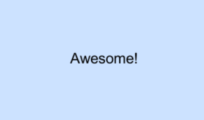

# Create UI components in Unity

{: .fs-6 .fw-300} 

Delight is an open source component-oriented framework for Unity, mainly centered around creating user-interface components that can easily be extended, combined and shared using a text based declarative design language (similar to HTML). 

[Asset Store Download](//assetstore.unity.com/packages/slug/150494){: .btn .btn-primary .fs-5 .mb-4 .mb-md-0 .mr-2 } [View it on GitHub](//github.com/delight-dev/Delight){: .btn .fs-5 .mb-4 .mb-md-0 } &nbsp;[](https://gitter.im/DelightChat/community?utm_source=badge&utm_medium=badge&utm_campaign=pr-badge)


## Quick Start

1. Import the [Delight unity package](link-to-package.html) into your Unity project. 


2. Create a new scene by right-clicking in your project hierarchy and choosing: 

   `Create -> Delight Scene`. 

   Press enter and open the newly created `NewScene.xml`  XML file and edit it so it contains the following content:

   {: .xml-file }

   NewScene.xml

   ```xml
   <NewScene xmlns="Delight" 
            xmlns:xsi="http://www.w3.org/2001/XMLSchema-instance"
            xsi:schemaLocation="Delight ../Delight.xsd">
     
       <Label Text="Awesome!" />
   
   </NewScene>
   ```
  


3. Open the Unity scene `NewScene.unity` that has been created in the same folder and run it.

Congratulations, you've created your first scene in Delight :). 



Check out the [Tutorials](Tutorials/Tutorials) and get started creating some awesome UI components.


## News

Links to latest announcements.
