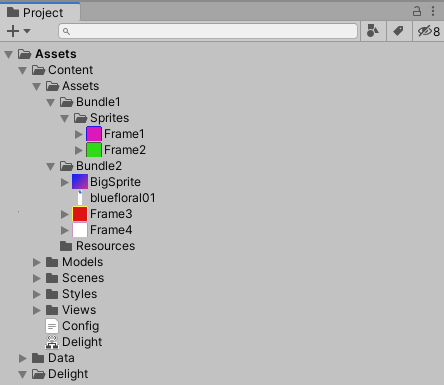

# Asset Management

1. TOC
{:toc}

## Introduction

This tutorial goes over how to work with assets such as Sprites, Fonts, Materials, etc. in the framework. 


## Asset Content

All assets used by the framework needs to reside inside the content folder: `Content/Assets/Resources` (path can be [configured](ConfigFile)). Once placed in that folder the assets can be referenced in the XML by their name:

{: .xml-file }

MyView.xml

```xml
<MyView>
  <Image Id="MyImage" Sprite="RainbowSquare" />
</MyView>
```

In this case `RainbowSquare` is an asset that comes with the framework. 


## Accessing Assets in Code

The framework also generates code for accessing the assets programmatically:

```csharp
public partial class MyView : UIView
{
    public void SomeMethod()
    {
        MyImage.Sprite = Assets.Sprites.CheckBox;
        // MyImage.Sprite = Assets.Sprites["RainbowSquare"];
    }
}
```


## Asset Bundles

Asset bundles are generated automatically based on the folder the asset resides in. For example:



Any assets put in a folder not called `Resources` under `Content/Assets/` will be put into bundles that corresponds to the name of the folder. In this case the framework generates two asset bundles called `Bundle1` and `Bundle2`. If the sprite  `Frame1` is referenced, `Bundle1` gets loaded and if `BigSprite` is referenced, `Bundle2` gets loaded.


