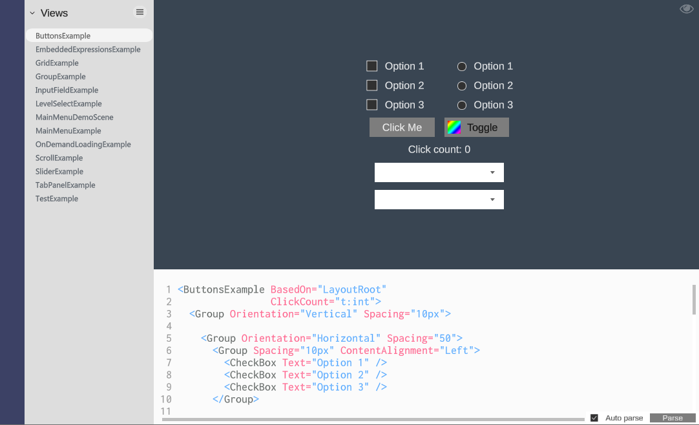

# Designer

1. TOC
{:toc}

## Introduction

The Delight Designer allows you to create and edit view XML while the editor is playing and see the changes take effect immediately as you make them, which allows for a fast workflow. It also has more advanced auto-complete features than the visual studio editor, and allows you to select views with your mouse and see them highlighted in the XML. 




## Enabling the Designer

The designer requires the TextMeshPro module to be activated in the project:

1. Import the latest TextMeshPro package into your project. You can do this through the package manager.

2. Open Content/Config.txt and add the TextMeshPro module:

   {: .xml-file }

   Config.txt

   ```yaml
   Modules: 
     TextMeshPro 
   ```


Then you can open the Delight Designer through the button *Open Designer* in the Delight window or by manually opening and running the `Delight\Content\Scenes\DelightDesigner.unity` scene. 


## Keyboard & Mouse commands

| Command         | Description                                                  |
| --------------- | ------------------------------------------------------------ |
| CTRL+S          | Saves all changes (ignore unity warning about editor running) |
| F1              | Open online help section for the view the caret is on.       |
| F5              | Reload view (used if auto-reload is disabled)                |
| F10             | Jump to last opened view                                     |
| F11             | Maximize designer window                                     |
| F12             | Jump to definition. Opens the view the caret is on.          |
| CTRL+SHIFT+L    | Unlocks locked views for edit. Locked views are generally not intended to be editable. |
| CTRL+Space      | Trigger intellisense/autocomplete                            |
| CTRL+Z          | Undo last XML edit                                           |
| CTRL+Y          | Redo last XML edit                                           |
| Left click      | Click on views in the display region to select them and highlight them in the XML editor |
| CTRL+Left click | Multi-select views in display region. Can also be used to select views in the XML editor by clicking on the text. |
| CTRL+Scroll     | If a view is selected CTRL+Scroll down selects the parent view. And CTRL+Scroll up moves back down in the hierarchy towards the initially selected view. |


## Locking Views

Sometimes you want to display one view while editing another. This is often the case when the view you're editing is displayed within another view and you want to see how it appears there while you're editing it. 


To do this you want to go to the view you want displayed and click on the *lock view* icon in the top-right corner in the display region: 

Now you can switch to the view you want to edit and the display region will stay locked. 


## Disabling Auto-parse

The editor is going to be optimized, but right now it can get slow when you're editing complicated views. If it gets too slow you can disable the auto-parser by unchecking the checkbox in the lower-right corner: 

After doing so the view will only be parsed when you click on the Parse button or press `F5`. 


## Renaming Views

The designer makes it easier to change the name of views. Simply rename the view in the XML editor and save. The designer will automatically rename the view files, the code-behind and all the references to the view in other XML. 