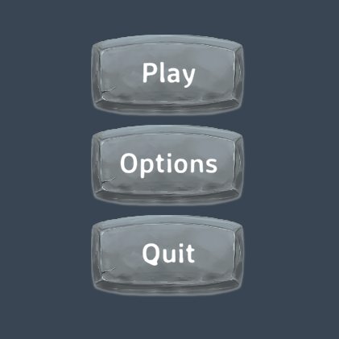
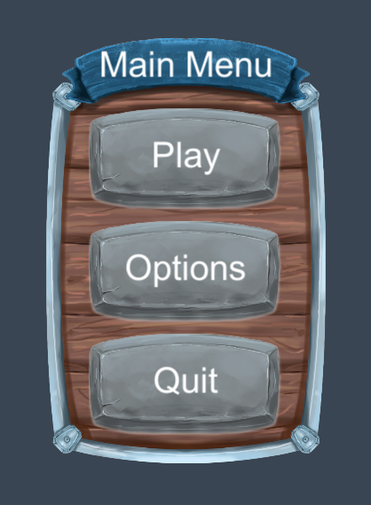

# Getting Started

1. TOC
{:toc}

## Introduction

This tutorial serves as a practical introduction to the framework by showing you how to create a main menu.


## Creating the MainMenu scene

We'll start by creating a Main Menu scene. Right-click in your project hierarchy and choose `Create -> Delight Scene`. Give it the name `MainMenuScene` and press enter.

Open the scene `MainMenuScene.xml` and add a `MainMenu` view to it:

{: .xml-file }

MainMenuScene.xml

```xml
<MainMenuScene xmlns="Delight" xmlns:xsi="http://www.w3.org/2001/XMLSchema-instance" xsi:schemaLocation="Delight ../Delight.xsd">
    <MainMenu />    
</MainMenuScene>
```

You've now created a scene that is set up to display a single view, the `MainMenu`. The framework sees that the view `MainMenu` doesn't exist and will automatically generate it for you. You now should have the following files in your project:


{: .info-box }
Note you can also manually create new views by choosing `Create -> Delight View`

You can now open `MainMenuScene.unity` which you can run throughout the tutorial to see the main menu taking shape.

{: .info-box }
All content files, like the XML files MainMenuScene.xml and MainMenu.xml are automatically processed by the framework as they are changed (if the editor is open). To manually tell the framework to process all content, press the "Rebuild All" button in the Delight window (Window -> Delight). Also note that files with the "_g" postfix are generated (and overwritten) when the XML files are processed.


## Creating the Main Menu view

Open the `MainMenu` view and edit it so it contains the following:

{: .xml-file }

MainMenu.xml

   ```xml
<MainMenu xmlns="Delight" xmlns:xsi="http://www.w3.org/2001/XMLSchema-instance" 
          xsi:schemaLocation="Delight ../Delight.xsd">
  <Group Spacing="10">
    <Button Text="Play" />
    <Button Text="Options" />
    <Button Text="Quit" />
  </Group>
</MainMenu>
   ```

The name of the root tag `<MainMenu>` is the name we've given the view. The view contains three [Button](../Api/Views/Button) views that are arranged vertically by a [Group](../Api/Views/Group) view. The [API](../Api/Views/Views) contains detailed information about all the 40+ views included in the framework.

`Spacing="10"` and `Text="Play"` are [dependency properties](Views#dependency-properties) that changes the layout and behavior of the  view. E.g. `Spacing="10"` tells the `Group` view to insert a spacing of 10 pixels between the buttons.

Different views have different properties but most views are based on the `UIView` which has the following properties that are used to do layout:

| Dependency Property | Description                                                  |
| ------------------- | ------------------------------------------------------------ |
| Width               | Width of the view that can be specified in pixels "10" or percentage "100%". Some views are 100% by default (which means they take up the extent of their parent). The Group adjusts its size to its children by default. |
| Height              | Height of the view.                                          |
| Alignment           | Alignment of the view: TopLeft, Top, TopRight, Left, Center, Right, BottomLeft, Bottom, BottomRight. |
| Margin              | Specifies the view's margin from left, top, right and bottom. Defaults to "0,0,0,0". |
| Offset              | Specifies the view's offset from left, top, right, bottom. Defaults to "0,0,0,0". |
| BackgroundColor     | Background color of the view. Color values can be specified by name (Red, Blue, Coral, etc), hexcode (#aarrggbb or #rrggbb) or rgb/rgba value ("1.0,0.0,0.5" or "1,1,1,0.5"). Undefined by default. |
| BackgroundSprite    | The background sprite of the view. The value is the name of the sprite asset file without extension, e.g. "mysprite". |

You can also add your own custom dependency properties to your view.


## Responding to button clicks

Open the `MainMenu` view and add the following click-handlers to the XML:

{: .xml-file }

MainMenu.xml

```xml
<MainMenu xmlns="Delight" xmlns:xsi="http://www.w3.org/2001/XMLSchema-instance" 
          xsi:schemaLocation="Delight ../Delight.xsd">
  <Group Spacing="10">
    <Button Text="Play" Click="Play" />
    <Button Text="Options" Click="ShowOptions" />
    <Button Text="Quit" Click="Quit" />
  </Group>
</MainMenu>

```

{: .info-box }
`Click` is one of the standard view actions that can be set on all views (others include `Drag`, `MouseEnter`, `MouseUp`, `Scroll`, etc.).

This will generate the click handlers in the code-behind. Modify the handlers so they log messages:

{: .cs-file }

MainMenu.cs

```c#
namespace Delight
{
    public partial class MainMenu
    {
        public void Play()
        {
            Debug.Log("Play clicked");
        }

        public void ShowOptions()
        {
            Debug.Log("Options clicked");
        }

        public void Quit()
        {
            Debug.Log("Quit clicked");
        }
    }
}
```

If you run the scene and click on the buttons you'll see the text being logged in the console:


## Styling

To make the buttons look more interesting we're going to change their style. Open up the `Content/Styles/Styles.xml` file and add the following content:

{: .xml-file }

Styles.xml

```xml
<Styles>
  <Button Style="StoneButton" BackgroundSprite="MainMenuDemoButton" 
          Pressed-BackgroundSprite="MainMenuDemoButtonPressed"
          BackgroundColor="White" Highlighted-BackgroundColor="White" 
          Pressed-BackgroundColor="White" Width="218" Height="117"
          FontSize="40" Font="AveriaSansLibre-Bold SDF" TextOffset="0,0,0,6" 
          StateAnimations="" FontColor="White" Highlighted-FontColor="White" 
          Pressed-FontColor="#cccccc" />
</Styles>

```

We've declared one button style `StoneButton` with some values that will be set whenever the style is applied. See the [Styles](Styles) tutorial for more information about styling views. Next step is to apply our new style to our buttons:

{: .xml-file }

MainMenu.xml

```xml
<MainMenu xmlns="Delight" xmlns:xsi="http://www.w3.org/2001/XMLSchema-instance" 
          xsi:schemaLocation="Delight ../Delight.xsd">
  <Group Spacing="10">
    <Button Style="StoneButton" Text="Play" Click="Play" />
    <Button Style="StoneButton" Text="Options" Click="ShowOptions" />
    <Button Style="StoneButton" Text="Quit" Click="Quit" />
  </Group>
</MainMenu>

```





Next  we modify the main menu to add a background image and title:

{: .xml-file }

MainMenu.xml

```xml
<MainMenu xmlns="Delight" xmlns:xsi="http://www.w3.org/2001/XMLSchema-instance" 
          xsi:schemaLocation="Delight ../Delight.xsd">
  <Image Sprite="MainMenuDemoBg" Height="480" PreserveAspect="True" />
  <Label Style="MainMenuDemoTitle" Text="Main Menu" Offset="0,0,0,210" />
  <Group Spacing="10" Offset="0,25,0,0">
    <Button Style="StoneButton" Text="Play" Click="Play" />
    <Button Style="StoneButton" Text="Options" Click="ShowOptions" />
    <Button Style="StoneButton" Text="Quit" Click="Quit" />
  </Group>
</MainMenu>
```

The sprite *MainMenuDemoBg* is another asset that comes with the framework examples. We should now see the following:




## Showing a Level Select Menu

We want to show a LevelSelect view when the user clicks on the Play button. To do this we can add a [ViewSwitcher](../Api/Views/ViewSwitcher) view and add various views as children:

{: .xml-file }

MainMenu.xml

```xml
<MainMenu xmlns="Delight" xmlns:xsi="http://www.w3.org/2001/XMLSchema-instance" 
          xsi:schemaLocation="Delight ../Delight.xsd">
  <ViewSwitcher Id="SubmenuSwitcher">
    
    <!-- first view, our main menu buttons, are shown by default -->
    <Region Id="MainMenuWindow">
      <Image Sprite="MainMenuDemoBg" Height="480" PreserveAspect="True" />
      <Label Style="MainMenuDemoTitle" Text="Main Menu" Offset="0,0,0,210" />
      <Group Spacing="10" Offset="0,25,0,0">
        <Button Style="StoneButton" Text="Play" Click="Play" />
        <Button Style="StoneButton" Text="Options" Click="ShowOptions" />
        <Button Style="StoneButton" Text="Quit" Click="Quit" />
      </Group>
    </Region>
    
    <!-- second view, level select, is shown when we switch to it -->
    <LevelSelectExample Id="LevelSelectWindow" NavigateBack="LevelSelectNavigateBack" />
    
  </ViewSwitcher>
</MainMenu>
```


The level select view already exists so now all we need to do is to implement some logic in code-behind to switch back and forth between our main menu buttons and the level select view.

{: .cs-file }

MainMenu.cs

```c#
namespace Delight
{
    public partial class MainMenu
    {
        public void Play()
        {
            SubmenuSwitcher.SwitchTo(LevelSelectWindow);
        }

        public void ShowOptions()
        {
            Debug.Log("Options clicked");
        }

        public void Quit()
        {
            Debug.Log("Quit clicked");
        }
        
        public void LevelSelectNavigateBack()
        {
            SubmenuSwitcher.SwitchTo(MainMenuWindow);
        }
    }
}
```

There you have it, a simple main menu. 


## Delight Designer

I recommend playing around in the [delight designer](Designer) to explore the different example views and edit them to get real-time feedback as you make changes in the XML. To enable the delight designer you need to [Enable TextMeshPro](EnablingTextMeshPro), and then press "Rebuild All" in the delight window, to update the designer, and then you can open the Delight Designer scene and play it to start the designer. See the [Designer](Designer) tutorial for more information on how to use the designer.

Good luck and if you have any questions be sure to check the rest of the tutorials and pop into the Delight [chat room](https://discord.gg/9BVyVsB) for support.