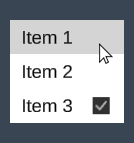
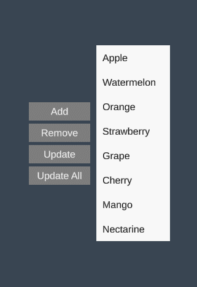
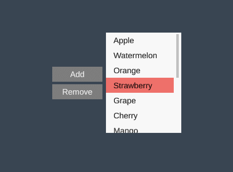
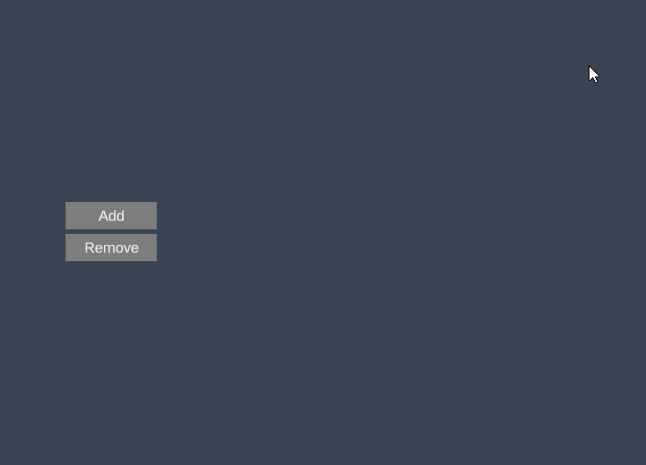
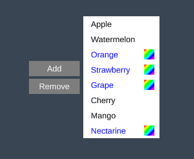

# Lists

1. TOC
{:toc}

## Introduction

This tutorial goes over how to work with the [List](../Api/Views/List) view. It shows how to create static lists, dynamic lists, virtualized lists, flow lists and more. It demonstrates how to bind collections of data to the List view and how to handle common operations such as item selection, adding and updating. There are a number of other views that can present dynamic list data such as the [ComboBox](../Api/Views/ComboBox) and [TabPanel](../Api/Views/TabPanel) but most of the information in this tutorial will be applicable to those views as well. 


## Static List

If you want to present a static list of items, i.e. list that don't change during runtime, you can use either a [Group](../Api/Views/Group) or a [List](../Api/Views/List) view. Group view is useful if you only want to snug items together horizontally or vertically. The *List* view provides additional functionality such as selection logic, scrolling and the option to have items wrap as they reach the boundaries of the list. 

{: .xml-file }

MyStaticList.xml

```xml
<MyStaticList>

  <List BackgroundColor="White">
    <ListItem Size="100;30">
      <Label Text="Item 1" AutoSize="True" Alignment="Left" 
             Margin="10,0,0,0" />
    </ListItem>
    <ListItem Size="100;30">
      <Label Text="Item 2" AutoSize="True" Alignment="Left" 
             Margin="10,0,0,0" />
    </ListItem>
    <ListItem Size="100;30">      
      <Label Text="Item 3" AutoSize="True" Alignment="Left" 
             Margin="10,0,0,0" />
      <CheckBox Alignment="Right" />
    </ListItem>
  </List>

</MyStaticList>
```



The items are arranged vertically by default and the size of the list will automatically adjust to the items. If you don't specify the size of individual list items they will adjust their size to their content by default. 


## Dynamic List

To display a data collection in a dynamic list we first need to define the data model. The easiest way to do this is by using schemas to generate the necessary classes.

{: .schema-file }

Schema.txt

```text
= Fruit
string Name
Sprite Icon

+ Fruit (Name, Icon)
"Apple", RainbowSquare
"Watermelon", RainbowSquare
"Orange", RainbowSquare
"Strawberry", RainbowSquare
"Grape", RainbowSquare
"Cherry", RainbowSquare
"Mango", RainbowSquare
"Nectarine", RainbowSquare

```

The schema above generates a global bindable collection *Weapons* populated with data. Presenting the fruits:

{: .xml-file }

FruitList.xml

```xml
<FruitList>

  <List Items="{fruit in @Fruits}">    
    <Label Text="{fruit.Name}" />
  </List>

</FruitList>
```

Three important things are going on here:

1. The first thing we do is to bind the *Fruits* collection to the list view:

   `<List Items="{fruit in @Fruits}">`

   *fruit* is the name we use to refer to the items in the list (you can use any name you want) and *@Fruits* refers to our data model, the *@* symbol specifies that it refers to our data model and not a local property in  the *FruitList* view. 

2. We define the item template which in this case consist of a single *Label* that will automatically be wrapped by a *ListItem* view by the framework. 

3. Lastly we bind the item property *Name* to the label:

   `<Label Text="{fruit.Name}"  />`

If the *Fruits* collection is updated anywhere the list will be automatically updated as well. The below example shows a more advanced item template:

```xml
<List Items="{fruit in @Fruits}" BackgroundColor="White">
  <ListItem Width="150">
    <Image Sprite="{fruit.Icon}" Alignment="Left" Offset="10,0,0,0" />
    <Label Text="{fruit.Name}" AutoSize="True" Alignment="Left" 
           Margin="40,0,0,0" />
  </ListItem>
</List>
```


## List Operations

Any changes to the list are done through the *Fruits* collection. Let's add some buttons that demonstrates common list operations:

{: .xml-file }

FruitList.xml

```xml
<FruitList SelectedFruit="t:Fruit">

  <Group Orientation="Horizontal">

    <Group Spacing="5">
      <Button Text="Add" Width="100" Click="AddFruit" />
      <Button Text="Remove" Width="100" Click="RemoveFruit" />
      <Button Text="Update" Width="100" Click="UpdateSelectedFruit" />
      <Button Text="Update All" Width="100" Click="UpdateAllFruits" />
    </Group>

    <List Items="{fruit in @Fruits}" Margin="10,0,0,0" 
          BackgroundColor="White" SelectedItem="{SelectedFruit}">
      <Label Text="{fruit.Name}" Margin="10,0,0,0" />
    </List>

  </Group>
  
</FruitList>
```

We've added a local dependency property called *SelectedFruit* that is bound to the *SelectedItem* in the list. We also created some buttons and click handlers to manipulate the list:

{: .cs-file }

FruitList.cs

```cs
namespace Delight
{
    public partial class FruitList
    {
        public void AddFruit()
        {
            Models.Fruits.Add(new Fruit { Name = "New Fruit" });
        }

        public void RemoveFruit()
        {
            if (SelectedFruit == null)
                return;

            Models.Fruits.Remove(SelectedFruit);
        }

        public void UpdateSelectedFruit()
        {
            if (SelectedFruit == null)
                return;

            SelectedFruit.Name += "*";
        }

        public void UpdateAllFruits()
        {
            foreach (var fruit in Models.Fruits)
            {
                fruit.Name += "*";
            }
        }
    }
}
```



In code the global fruits collection is accessed through *Models.Fruits*, which can be manipulated from any part of your game and the changes will automatically propagate to any lists that it's bound to.

A  few more list operations that can be useful:

```cs
// scroll to item
Models.Fruits.ScrollTo(fruit);

// select item
Models.Fruits.Select(fruit);

// replace list
Models.Fruits.Replace(newFruitList);
```


## Scrollable List

Scrollable lists have a defined viewport size and allows the user to scroll through its content. 

```xml
<List Items="{fruit in @Fruits}" IsScrollable="True"
      Width="150" Height="100" BackgroundColor="White">
  <ListItem Height="30"> 
    <Label Text="{fruit.Name}" />
  </ListItem>
</List>
```



To create a scrollable list do the following:

1. Set `IsScrollable="True"` on the list.
2. Set `Width` and `Height` on the list to define the viewport size. 

There are a number of properties that are interesting when working with scrollable lists. The below example shows some of them.

```xml
<List Items="{fruit in @Fruits}" IsScrollable="True"
      Width="150" Height="100" BackgroundColor="White"
      ScrollableRegionContentAlignment="Top" 
      DisableInteractionScrollDelta="1" 
      HasInertia="False" 
      VerticalScrollbarVisibility="Auto" 
      VerticalScrollbarBackgroundColor="#c3c3c3" 
      VerticalScrollbarHandleColor="#9f9f9f" 
      VerticalScrollbarBarColor="#c3c3c3"
      VerticalScrollbarWidth="6" 
      VerticalScrollbarBarMargin="0,0,2,0" 
      VerticalScrollbarOffset="0,0,0,0">
  <ListItem Height="30"> 
    <Label Text="{fruit.Name}" />
  </ListItem>
</List>
```


## Flow List

In a flow list items are arranged horizontally or vertically and wrap around to the next line when reaching the bounds of the list. 

```xml
<List Overflow="Wrap" Items="{fruit in @Fruits}" Spacing="5" Width="460"
      Orientation="Horizontal">
  <ListItem Width="150" Height="150" BackgroundColor="Lavender">
    <Label Text="{fruit.Name}" AutoSize="True" />
  </ListItem>
</List>
```



To create the horizontally flowing list we do the following:

1. Set `Overflow="Wrap"` which makes the items wrap when they reach the edge of the bounds.
2. Set `Orientation="Horizontal"` to make the items flow horizontally. 
3. Set `Width` so the list has a defined horizontal size. 

To make the list flow vertically you can set orientation to *Vertical* and specify the *Height* of the list. 


## Virtualized List

Virtualized lists only creates objects for the items visible in the viewport which greatly improves performance of lists that are large. To create a virtualized list simply set *IsVirtualized="True"*. 

```xml
<List Items="{fruit in @Fruits}" IsVirtualized="True"
      Width="150" Height="100" BackgroundColor="White">
  <ListItem Height="30"> 
    <Label Text="{fruit.Name}" />
  </ListItem>
</List>

```

To create the virtualized list we do the following:

1. Set `IsVirtualized="True"` on the list. 
2. Set `Width`and `Height` on the list to define the viewport size.
3. Set `Height` on the list item to define the item size (see section below on how to create dynamically sized virtualized items).

Virtualized lists always have a defined size and are always scrollable. Items need to have a pre-defined size.


### Virtualized Lists with Differently Sized Items

The list items in a virtualized list need to have a pre-defined size in order to calculate their position in the list (before they are created). You may have a virtualized list that features differently sized items, e.g. a chat window where each chat entry size depends on the length of the text. To do this you can specify the `VirtualItemGetter`method on the list: 

{: .xml-file }

FruitList.xml

```xml
<List Items="{fruit in @Fruits}" IsVirtualized="True" 
      Width="150" Height="100" BackgroundColor="White"
      VirtualItemGetter="GetVirtualFruitItem">
```

And implement it in code-behind: 

{: .cs-file }

FruitList.cs

```c#
namespace Delight
{
    public partial class FruitList
    {
        public VirtualItem GetVirtualFruitItem(Fruit fruit)
        {
            // calculate dynamic height based on fruit data
            int height = fruit.Size; 
            return VirtualItem.FromHeight(height);
        }
    }
}
```

*GetVirtualFruitItem()* takes the item data as a parameter and returns a virtual item that has a pre-defined size that you can calculate based on the item data. 


## Multiple Item Templates

A list may have multiple item templates.

{: .xml-file }

FruitList.xml

```xml
<List Items="{fruit in @Fruits}" TemplateSelector="FruitItemTemplateSelector" 
      Width="150" BackgroundColor="White">
  <ListItem Id="FruitA" Height="30">
    <Label Text="{fruit.Name}" />
  </ListItem>
  <ListItem Id="FruitB" Height="30">
    <Image Sprite="{fruit.Icon}" Alignment="Right" Offset="0,0,10,0" />
    <Label Text="{fruit.Name}" FontColor="Blue" />
  </ListItem>
</List>

```

To create a list with multiple templates we do the following:

1. Specify multiple `<ListItem>`'s each with a unique ID set. These are the different templates we'll use.
2. Specify the `TemplateSelector` method on the list and implement it in code-behind.

{: .cs-file }

FruitList.cs

```c#
namespace Delight
{
    public partial class FruitList
    {
        public string FruitItemTemplateSelector(Fruit fruit)
        {
            switch (fruit.Name)
            {
                case "Watermelon":
                case "Apple":
                case "Mango":
                case "Cherry":
                default:
                    return "FruitA"; // use the template "FruitA"

                case "Orange":
                case "Strawberry":
                case "Grape":
                case "Nectarine":
                    return "FruitB"; // use the template "FruitB"
            }
        }
    }
}
```

*FruitItemTemplateSelector()* takes the item data as a parameter and returns the ID of the template to be used to display the item. 

