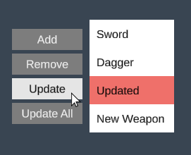

# Lists

1. TOC
{:toc}

## Introduction

This tutorial goes over how to work with and present static and dynamic lists of data through the [List](../Api/Views/List) view. It shows how to bind collections of data to the List and how to handle common operations such as item selection, adding and updating. There are a number of other views that can present dynamic list data such as the [ComboBox](../Api/Views/ComboBox) and [TabPanel](../Api/Views/TabPanel) but most of the information in this tutorial will be applicable to those views as well. 


## Static List

If you want to present a static list of items, i.e. list that don't change during runtime, you can use either a [Group](../Api/Views/Group) or a [List](../Api/Views/List) view. Group view is useful if you only want to snug items together horizontally or vertically. The *List* view provides additional functionality such as selection logic, scrolling and the option to have items wrap as they reach the boundaries of the list. 

{: .xml-file }

MyStaticList.xml

```xml
<MyStaticList>

  <List BackgroundColor="White">
    <ListItem Size="100;30">
      <Label Text="Item 1" AutoSize="True" Alignment="Left" 
             Margin="10,0,0,0" />
    </ListItem>
    <ListItem Size="100;30">
      <Label Text="Item 2" AutoSize="True" Alignment="Left" 
             Margin="10,0,0,0" />
    </ListItem>
    <ListItem Size="100;30">      
      <Label Text="Item 3" AutoSize="True" Alignment="Left" 
             Margin="10,0,0,0" />
      <CheckBox Alignment="Right" />
    </ListItem>
  </List>

</MyStaticList>
```


The items are arranged vertically by default and the size of the list will automatically adjust to the items. If you don't specify the size of individual list items they will adjust their size to their content by default. 


## Dynamic Lists

To display a data collection in a dynamic list we first need to define the data model. The easiest way to do this is by using schemas to generate the necessary classes.

{: .schema-file }

Schema.txt

```text
= Weapon
string Name
Sprite Icon

+ Weapon (Name, Icon)
"Sword", RainbowSquare
"Dagger", RainbowSquare
"Spear", RainbowSquare
```

The schema above generates a global bindable collection *Weapons* populated with three items. Presenting the weapons:

{: .xml-file }

WeaponsList.xml

```xml
<WeaponsList>

  <List Items="{weapon in @Weapons}">    
    <Label Text="{weapon.Name}" />
  </List>

</WeaponsList>
```

Three important things are going on here:

1. The first thing we do is to bind the *Weapons* collection to the list view:

   `<List Items="{weapon in @Weapons}">`

   *weapon* is the name we use to refer to the items in the list (you can use any name you want) and *@Weapons* refers to our data model, the *@* symbol specifies that it refers to our data model and not a local property in *MyDynamicList*. 

2. We define the item template which in this case consist of a single *Label* that will automatically be wrapped by a *ListItem* view by the framework. 

3. Lastly we bind the item property *Name* to the label:

   `<Label Text="{weapon.Name}"  />`

If the *Weapons* collection is updated anywhere the list will be automatically updated as well. The below example shows a more advanced item template:

```xml
<List Items="{weapon in @Weapons}" BackgroundColor="White">
  <ListItem Width="150">
    <Image Sprite="{weapon.Icon}" Alignment="Left" Offset="10,0,0,0" />
    <Label Text="{weapon.Name}" AutoSize="True" Alignment="Left" 
           Margin="40,0,0,0" />
  </ListItem>
</List>
```


## List Operations

Any changes to the list are done through the *Weapons* collection. Let's add some buttons that demonstrates common list operations:

{: .xml-file }

WeaponsList.xml

```xml
<WeaponsList SelectedWeapon="t:Weapon">

  <Group Orientation="Horizontal">

    <Group Spacing="5">
      <Button Text="Add" Width="100" Click="AddWeapon" />
      <Button Text="Remove" Width="100" Click="RemoveWeapon" />
      <Button Text="Update" Width="100" Click="UpdateSelectedWeapon" />
      <Button Text="Update All" Width="100" Click="UpdateAllWeapons" />
    </Group>

    <List Items="{weapon in @Weapons}" Margin="10,0,0,0" 
          BackgroundColor="White" SelectedItem="{SelectedWeapon}">
      <Label Text="{weapon.Name}" Margin="10,0,0,0" />
    </List>

  </Group>
  
</WeaponsList>
```

We've added a local dependency property called *SelectedWeapon* that is bound to the *SelectedItem* in the list. We also created some buttons and click handlers to manipulate the list:

{: .cs-file }

WeaponsList.cs

```cs
namespace Delight
{
    public partial class WeaponsList
    {
        public void AddWeapon()
        {
            Models.Weapons.Add(new Weapon { Name = "New Weapon" });
        }

        public void RemoveWeapon()
        {
            if (SelectedWeapon == null)
                return;

            Models.Weapons.Remove(SelectedWeapon);
        }

        public void UpdateSelectedWeapon()
        {
            if (SelectedWeapon == null)
                return;

            SelectedWeapon.Name = "Updated";
        }

        public void UpdateAllWeapons()
        {
            foreach (var weapon in Models.Weapons)
            {
                weapon.Name = "Updated All";
            }
        }
    }
}
```



In code the global weapons collection is accessed through *Models.Weapons*, which can be manipulated from any part of your game and the changes will automatically propagate to any lists that it's bound to.


## List Operations

Any changes to the list are done through the *Weapons* collection. Let's add some buttons that demonstrates common list operations:

{: .xml-file }

WeaponsList.xml

```xml
<WeaponsList SelectedWeapon="t:Weapon">

  <Group Orientation="Horizontal">

    <Group Spacing="5">
      <Button Text="Add" Width="100" Click="AddWeapon" />
      <Button Text="Remove" Width="100" Click="RemoveWeapon" />
      <Button Text="Update" Width="100" Click="UpdateSelectedWeapon" />
      <Button Text="Update All" Width="100" Click="UpdateAllWeapons" />
    </Group>

    <List Items="{weapon in @Weapons}" Margin="10,0,0,0" BackgroundColor="White"
          SelectedItem="{SelectedWeapon}">
      <Label Text="{weapon.Name}" Margin="10,0,0,0" />
    </List>

  </Group>
  
</WeaponsList>
```

We've added a local dependency property called *SelectedWeapon* that is bound to the *SelectedItem* in the list. We also created some buttons and click handlers to manipulate the list:

{: .cs-file }

WeaponsList.cs

```cs
namespace Delight
{
    public partial class WeaponsList
    {
        public void AddWeapon()
        {
            Models.Weapons.Add(new Weapon { Name = "New Weapon" });
        }

        public void RemoveWeapon()
        {
            if (SelectedWeapon == null)
                return;

            Models.Weapons.Remove(SelectedWeapon);
        }

        public void UpdateSelectedWeapon()
        {
            if (SelectedWeapon == null)
                return;

            SelectedWeapon.Name = "Updated";
        }

        public void UpdateAllWeapons()
        {
            foreach (var weapon in Models.Weapons)
            {
                weapon.Name = "Updated All";
            }
        }
    }
}
```


In code the global weapons collection is accessed through *Models.Weapons*, which can be manipulated from any part of your game and the changes will automatically propagate to any lists that it's bound to.