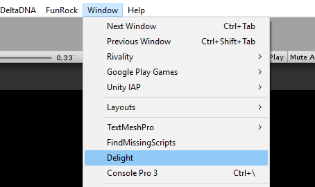
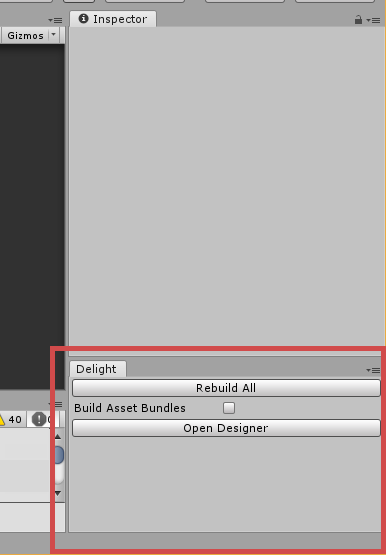
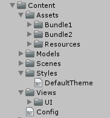
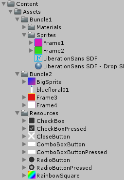

# MarkLight Migration Guide

1. TOC
{:toc}

## Introduction

This document describes how to migrate from MarkLight to Delight and also highlights the new features and differences between the versions. 

## Setup

1. Import the Delight package (e.g. Delight\Releases\2019.1.0\Delight-2019.1.0.unitypackage). 

2. Open the Delight window.

    

    Attach it for easy access:

    

The button **Rebuild All** generates code for all views as well as for assets and configuration. Used when when views, configuration or assets has been changed while the editor was closed, or if all the code needs to be regenerated because of errors after getting latest from source control. Note that if you change, e.g. a view XML while the editor is open and switch to the editor, the necessary code is automatically generated (will trigger a recompile of the project).

The checkbox *Build Asset Bundles* need to be checked if you've moved assets while the editor was closed and want all the asset bundles and asset code to be rebuilt.


## Overview

### Folder Structure

`/Delight/` contains the framework source code, assets and standard views. 

`/Content/` is where your project's views and assets will be residing:



- `Content/Assets` contains the assets (sprites, fonts, etc) used in your views.
- `Content/Models` contains your bindable data-model (C# classes) automatically generated from a schema file (or manually created). It's a new feature that you may use in the future to more easily bind to your model objects (and have them globally accessable and decoupled from your UI).
- `Content/Styles` contains your styling/theming XML files.
- `Content/Views` contains your views. Note that both XML and generated code / custom code-behind logic, resides in the same place in Delight.
- `Content/Config.txt` allows you to configure the Delight framework, e.g. set build target and server uri for asset bundles.

### Views

The views in the `Content/Views` folder and each view consist of three files (or two if you don't have any custom logic). So a view *MyView* can look like this.

*MyView.xml*:

```xml
<MyView Test="t:MyType">
    <Label Id="MyLabel" Text="Hello" />
</MyView>
```

This is your view XML file that the code is generated from. 

*MyView_g.cs* (generated):

```csharp
public partial class MyView : UIView
{ 
    public readonly static DependencyProperty<MyType> TestProperty = new DependencyProperty<MyType>("Test");
    public MyType Test
    {
        get { return TestProperty.GetValue(this); }
        set { TestProperty.SetValue(this, value); }
    }
    
    // ... etc.
}
```

Generated automatically when MyView.xml changes or *Reload All* button is pressed in the Delight window. It contains the dependency properties, constructor logic, binding logic and data-templates for the view.

*MyView.cs* (custom logic):

```csharp
public partial class MyView
{
    protected override void AfterLoad()
    {
        base.AfterLoad();
        
        // do stuff when the view has been loaded
        Debug.Log("Test = " + Test);
        Debug.Log("MyLabel.Text = " + MyLabel.Text);
    }
}
```

Since it's a partial class you have access to the generated code, and can e.g. work with the Test property directly. So the main difference at this point is that all properties are defined in the XML as shown and you access  values directly and don't need to go through a `.Value` property. References to views in the XML (the Label in this case) are also automatically generated.

### Assets

All assets (fonts, sprites, etc) that are to be accessed by the framework need to reside in the `Content/Assets`folder. 



Assets in the `Assets/Resources` folder will be included in the build. The other assets will be put in asset bundles with the same name of the sub-folder the asset resides in. So the above content creates two asset bundles *Bundle1* and *Bundle2*. 

Once the assets are in place the framework generates the code and bundles automatically.  You can access your assets in your view XML:

```xml
<Image Sprite="BigSprite" />
```

Note that only the filename without extension needs to be specified (and on a side-note the default behavior of images is now to adjust their size and type to the sprite so you don't need to specify those). XML intellisense now also auto-completes assets you have in your project.

You can also access your sprite in code through the **Assets** static class:

```csharp
MyImage.Sprite = Assets.Sprites.BigSprite;
```

Assets and bundles will be automatically loaded/unloaded asynchronously on-demand as views that reference them are loaded/unloaded.

## Migrating a View

Here are the step to migrate views from MarkLight to Delight. This example shows the steps required to migrate the view **SearchView** that resided in the main ViewManager view. 

1. Copy the MarkLight view XML file to the Delight views folder, e.g. `Assets/MarkUX/Views/SearchView.xml` to `Content/Views/SearchView.xml`

2. Make the following changes in the XML:

   - Remove any *Id* and *xmlns* attribute on the root element.

   - Add the following *xmlns*, *xmlns:xsi* and *xsi:schemaLocation* attributes to enable XML intellisense (will work after the view is processed): 

     ```xml
     <SearchView xmlns="Delight" xmlns:xsi="http://www.w3.org/2001/XMLSchema-instance" xsi:schemaLocation="Delight ../Delight.xsd">
     ```

   - Comment out all the content inside the root element of the XML (or remove it), we'll uncomment/add it after step 3.

   - Switch to unity editor and it will process the view XML and create `SearchView_g.cs` which is the code generated for the view, containing constructors, data templates and dependency properties. And `SearchView.cs` which will contain your custom code-behind for the view.

3. Prepare to move your custom logic to the new view, e.g. in this case SearchView.cs with the following content:

   - Copy the namespaces from the old SearchView.cs file to the new SearchView.cs file. 

   - Make sure everything compiles and commit the changes. During the migration process make a habit of committing code when the code compiles - as you might encounter situations when the code-generation breaks and it's difficult to get back to a compilable state, and it's convenient to be able to just discard changes to get back.

   - Now copy the content of the old SearchView class to the new SearchView class.

   - You'll most likely receive a few compilation errors at this point. Common errors:

     `xyz does not contain a definition for 'Value'`  - occurs because Delight accesses values directly, so remove ".Value"

     `Cannot convert from 'Delight.ElementSize' to 'MarkLight.ElementSize'` - until you have converted fields such as `public _ElementSize ItemHeight;` to dependency properties (done later) these errors will remain.

   - Rename any ObservableList to BindableCollection. And make the below changes to the class used in the observable list. 

   - Make sure your presentation/data classes inherit from *BindableObject*:

     ```c#
     using Delight;
     
     namespace Rivality.Models
     {
     	public class SearchItemPresentation : BindableObject
     	{
     		public string Name;
     		// ...
     ```
     

   Replace fields and properties with versions that notifies observers when they are changed: 

     ```c#
     	public class SearchItemPresentation : BindableObject
     	{
     		private string _name;
     		public string Name
     		{
                 get { return _name; }
                 set { SetProperty(ref _name, value); }	
     		}
     ```

     The following sublime find/replace regex might help:

     ```
     Find:
     (public)\s+([a-zA-z0-9]+)\s+([a-zA-z0-9]+)\s*\{\s*+get;\s*set;\s*\}
     
     (public)\s+([a-zA-z0-9]+)\s+([a-zA-z0-9]+)\s*\{\s*+get;\s*private set;\s*\}
     
     (public)\s+([a-zA-z0-9]+)\s+([a-zA-z0-9]+)\;
     
     Replace:
     private \2 _\3\; \n \1 \2 \3 \n \{ \n get \{ return _\3\; \} \n set \{ SetProperty\(ref _\3\, value\)\; \} \n \}\n
     ```

     

4. Now it's time to add/uncomment the XML in the root element in SearchView.xml. 

   - Rename any BackgroundImage to BackgroundSprite in the XML. 

   - Assets are referenced by the asset name. So `<Image Sprite="path/to/SomeAsset.psd">` becomes `<Image Sprite="SomeAsset">`. The XML intellisense auto-completes asset names and should warn if the asset name isn't accurate. Also in rare cases two assets have the same name, then you need to further specify the bundle (same name as the sub-folder) it resides in, e.g: `<Image Sprite="AllianceProfile/WarRoom" />`. 

   - Remove all equal signs from binding, so `{=Property}` becomes `{Property}`. This is done because all bindings are now one-way by default except for checkbox/slider values, and input-field text, which are two-way by default. If you for some reason need to override the default behavior the prefix "=" sets the binding to be two-way and "-" sets the binding to be one-way. 

   - Search for List and VirtualizedList and change `<VirtualizedList Items="{MyItems}">` to `<List Items="{myItem in MyItems}" IsVirtualized="True">`, *myItem* is the item variable and you can name it anything you want (only make sure the name is unique if you have nested lists). Then change all bindings to Item from e.g. `<Label Text="{#=Item.PlayerName}>"` to `<Label Text="{myItem.PlayerName}">`. 

   - Rename VirtualizedListItem to ListItem. And remove IsTemplate="true" from ListItem. 

   - Binding to the Id property is no longer allowed (search the XML for `Id="{` to find it). You can pass it along the data as a parameter to the action handler. So you can change: `<Button Id="{tab.Id}" Click="SwitchTabClick">` to `<Button Click="SwitchTabClick(tab.Id)">`  and change the code-behind to take the string Id as a parameter `public void SwitchTabClick(string tabId)`. Note that you can also pass item data directly (rather than its Id) which might be preferable.

   - Switch to editor and new code will be generated. You'll likely receive many compilation errors at this point.

   - In the code, remove references to views like `public Group TabPanel;`  This will remove errors like:

     `The type 'SearchView' already contains a definition for 'xyz'`

     ``Ambiguity between 'SearchView.xyz' and 'SearchView.xyz'`

     These are references to views that now are generated automatically. Simply remove them from the view code-behind.

   - Convert dependency fields to dependency properties. This will remove errors like:

     `Cannot implicitly convert type 'bool' to 'MarkLight._bool'`

     You do this by removing the dependency field, e.g. `public _Color AlliancesTabColor;` and declaring the dependency property it in the root element of the SearchView.xml:

     ```xml
     <SearchView AlliancesTabColor="t:Color">
     ```

     This tells the framework to generate the dependency property AlliancesTabColor of the type Color (note that the type shouldn't start with underscore anymore as it's no longer a dependency field). 

     Fix any resulting errors like: `xyz does not contain a definition for 'Value'` by removing `.Value`

   - Generic list such as `ObservableList<SearchItemPresentation>` are renamed to BindableCollection and generic parameters are specified using `[type]` instead of `<type>` because of XML restrictions. Example:

     ```xml
     <SearchView SearchResults="t:BindableCollection[SearchItemPresentation]">
     ```

     Assets properties bound to the presentation class, that was renamed in Step 3, need to be renamed in the XML: 

     ```xml
     <Image Sprite="{searchResult.SpriteAsset}" /> 
     <!-- changed from Sprite="{#Item.Sprite}" -->
     ```

   - If there are any virtualized list click handlers in the code, rename the parameter VirtualizedItemSelectionActionData to  ItemSelectionActionData. If you haven't done it you'll get the following exception when clicking on list items: `ArgumentException: Object of type 'Delight.List' cannot be converted to type 'MarkLight.Views.UI.VirtualizedItemSelectionActionData'.`


### Misc Notes

- `MyPanel.ScrollRect.NormalizedPosition` accessed through `Panel.NormalizedPosition`

- If StartCoroutine is used you might get `Unity Script Relay Missing` error during runtime. Make sure the view has `EnableScriptEvents="True"` set on the root element. 

- `"#"` are no longer necessary or valid in bindings. It can be removed with no impact. 

- If script events such as `Start()`, `Awake()` or `Update()` are used in the code-behind, those needs to be overridden e.g. `public override void Awake() {...}` and `EnableScriptEvents="True"` need to be set in the XML otherwise the methods won't be called.

- If you have issues with the view not behaving correctly the second time you open it, it may have to do with variable not being reset when the view is unloaded (done automatically when you close the view). All dependency properties are automatically reset but if you have non-dependency properties (e.g. private or public fields in your class) those need to be reset manually in Unload(): 

  ```c#
          protected override void AfterUnload()
          {
              base.AfterUnload();
              _isUpdating = false;
              _isClosing = false;
          }
  ```

  


## Change Log

- Major changes are:

  - Code-generation - no parsing during run-time, no reflection, everything accessed directly
  - On-demand loading (asynchronous load of assets)
  - Asset Management
  - Binding to game model and generating model objects with schema files

- Auto-generation of action handlers (like `Click="OnClick"`) if it doesn't exist in code-behind.

- Auto-generation of views that don't exist (`<MyNewView />`) creates the view `MyNewView` in the same folder if it doesn't exist.

- You can pass parameters to action handlers: 

  `<Button Click="OnClick(SomeParameter)" />`

- Bindings are one-way by default except for some properties like Value on CheckBox and Slider as well as Text for InputField. If you want a custom property to default to two-way binding you can set that in XML: `<InputField Text="t:string" defaultBinding.Text="TwoWay">`

  To override default binding you can use the "=" prefix in bindings t oset binding to be two-way and "-" for one-way.

- You can specify multiple templates on lists:

  ```xml
      <List Items="{player in Players}" TemplateSelector="MyTemplateSelector">  
        <ListItem Id="TemplateA" Width="100" Height="100"> 
          <Image Color="{player.Color}" Margin="5" /> 
          <Label Text="{player.Name}" AutoSize="True" />
        </ListItem>
  
        <ListItem Id="TemplateB" Width="205" Height="100">
          <Image Color="{player.Color}" Margin="5" />
          <Label Text="Supreme {player.Name}" AutoSize="True" />
        </ListItem>
      </List>
  ```

  MyTemplateSelector is a method in code-behind that takes your data object (in this case Player) and returns a string specifying which Template (Id) to choose.

- Assets and Styles now show up in XML intellisense.

- If there are parse errors in XML you can double-click on the error entry to be taken to the line in the XML file that the error is at.

- ViewSwitcher loads views on-demand on default. Can be changed to regular behavior by setting `SwitchMode="Enable"`, or `SwitchMode="LoadOnce"`  for loading the view once, but then enabling/disabling. 

- Multi-binding with transformation methods can now reference any method (does not have to exist in the code-behind):

  `<Label Text="{$MyMethod({Property1}, {Property2})}" />`

- Value converters can be specified with the syntax:
  ` <Label Text="{MyValue | MyConverter}" />`

  Which generates the code: `Label.Text = Converters.MyConverter.ToString(MyValue);`
  So you need to add a field called MyConverter to the Converters class, you can do this by specifying a partial class in the Delight namespace:

  ```csharp
  public partial static class Converters
  {
      public static MyConverter MyConverter = new MyConverter();
  }
  ```

  The MyConverter class needs to contain a "ToTargetType(SourceType mySourceType)", where TargetType is the type you want to convert to and SourceType is the type of your source. For two-way bindings you also need to specify a method: SourceType FromTargetType().

- VirtualizedList functionality now embedded in the List view and is activated by setting `IsVirtualized="True"`. 

- Virtualized list can now have items that have dynamic sizes. To make it possible you need to provide a VirtualItemGetter method om the list:

  ```xml
  <List IsVirtualized="True" VirtualItemGetter="MyVirtualItemGetter" 
        Items="{player in @Players}">
    <ListItem>
       <!-- content with dynamic size -->
    </ListItem>
  </List>
  ```

  The method takes item data and returns a VirtualItem that has the size you want:

  ```csharp
  public VirtualItem GetVirtualItem(Player player)
  {
  	return VirtualItem.FromHeight(player.EntryHeight);
  }
  ```

- Framework now configured through `Content/Config.txt` where things like ServerUri (for remote asset bundles) and target build (Dev, Test, etc) can be set.

- The framework loads asset asynchronously, so if you display sprites with the Image view or text with certain font assets in Labels, those are loaded for you. But there are times perhaps when you want to work with assets in a custom view. To do this you declare an asset property as with any other type: `<MyCustomView MySprite="t:Sprite">`. Then you can use your view as this:
     `<MyCustomView MySprite="SomeSpriteName" />` or in bindings: 
     `<MyCustomView MySprite="{player.Icon}" />`. If your view is to respond and do something with the sprite, you can receive notification when the sprite changes by overriding the OnChanged method:

  ```csharp
  public override void OnChanged(string property)
  {
      switch (property)
      {
          case nameof(MySprite):
              var unitySprite = MySprite?.UnityObject;
              if (unitySprite != null)
              {
                  // do something with the sprite
              }
              break;
      }
  }
  ```

  

- You can set `UseFastShader="True"` on the `UIView` or any other view you want and it will replace the default UI shader with a simpler and faster one. The faster shader does not support masking and clipping.

- ObservableList replaced by BindableCollection.

- The faster RectMask2D is used by default as mask when no mask graphics is set (i.e. when mask is square).

- Setting internal values on certain objects such as Width and Offset (e.g. `myView.Width.Pixels = 100;` and `myView.Offset.Left = 100;`), now properly triggers layout changes in parents because of the concept of AtomicBindableObjects, which are objects that can change internally and are treated like the entire object has been replaced. 

- You can use  `Models/Schema.txt` specify your data game model (through DDL) and the framework will generate models objects (C# classes) and customizable data providers for you. 

- The framework also allows you to populate your model with data for different configurations (e.g. dev, staging, production), during compile-time.

- We can now do binding to your global data model through "@" prefix: 
  `       <View Property="{@Players}" />`
  Where Players is your custom data, a static field that resides within the partial static class `Models`:

  ```
  public partial static class Models 
  {
      public static MyObject Players = new MyObject();
  }
  ```

  

- The framework now provides a way to bind your game model to your UI through bindable objects, bindable collections, and data providers - which means once you've set those structures up, you can work with your model directly, access your model from anywhere, and have changes in your model propagate throughout the UI without any extra code. The model objects needs to be set up in a certain way, e.g. with INotifyProperty-changed events - the framework can help you generate those objects for you through the `Schema.txt` file.

- Asset bundle mechanism. Asset bundles are generated automatically by putting assets in the folder-structure: 

  ```
       Content/Assets/Bundle1/Sprites/MySprite1.psd
       Content/Assets/Bundle1/Sprites/MySprite2.psd
       Content/Assets/Bundle2/Sprites/MySprite2.psd
       Content/Assets/Bundle2/Sprites/MySprite3.psd
       Content/Assets/Resources/Sprites/MySprite4.psd
  ```

  All assets under the Content/Assets/ folder (base path can be configured) are processed by the framework. If assets are put in a Resources folder they will be included in the build. Otherwise they will be put in an asset bundle given the same name as the folder under Content/Assets/, e.g. in this case Bundle1 or Bundle2. 

  Once processed the framework will automatically handle the loading of sprites from their asset bundles when needed. You can also access your assets in code, e.g:

  `var sprite = Assets.Sprites.MySprite1;`

  Useful when you want to tie assets to your presentation models, either manually or the framework can do this for you through DDL. E.g. if you want an InventoryItem be tied to an icon asset, you just need to specify the name of the asset, and the framework will give you easy access to that sprite, for example when you want to bind it to an image view in XML:

  `<Image Sprite="{InventoryItem.Icon}" />`

- Scenes can be created by XML in the Content/Scenes folder: `<MyScene></MyScene>` generates MyScene.unity

- New Grid view for arranging views in a grid. 
  Below creates a 3x3 grid with 200px sized columns/row with the last column/row taking up the remainder of the space. 

  

  ```xml
  <Grid Cells="200,200,*; 200,200,*">  
      <Region Grid.Cell="0,0" Id="Cell00" BackgroundColor="#5389e0" />
      <Region Grid.Cell="0,1" Id="Cell01" BackgroundColor="#e375f9" />
      <Region Grid.Cell="0,2" Id="Cell02" BackgroundColor="#74f9d5" />
      <Region Grid.Cell="1,0" Id="Cell10" BackgroundColor="#f9c674" />
      <Region Grid.Cell="1,1" Id="Cell11" BackgroundColor="#fced2d" />
      <Region Grid.Cell="1,2" Id="Cell12" BackgroundColor="#2cf72f" />
      <Region Grid.Cell="2,0" Id="Cell20" BackgroundColor="#ef552b" />
      <Region Grid.Cell="2,1" Id="Cell21" BackgroundColor="#0087ff" />
      <Region Grid.Cell="2,2" Id="Cell22" BackgroundColor="#8730ad" />
  </Grid>
  ```
  
- When referencing assets in XML you only need to specify their name: 
  `<Image Sprite="MySprite" />`

-  Image views now adjust their size to the native size of the sprite if width and height isn't explicitly set.  Image views also set their type to "Spliced" for spliced sprites if the type isn't explicitly set. 
         `<Image Sprite="MySprite" Width="100" Height="100" Type="Spliced" />` 

  ...can now be specified as:
         `<Image Sprite="MySprite" />`

- New option to set width and height of views using Size property:
  `<Region Size="700,340" />` is the same as `<Region Width="700" Height="340" /> ` 

- Slightly different syntax when binding to collections/lists `<List Items="{highscore in @Highscores}">`. Instead of binding to #Item you use the name specified: `<Label Text="{highscore.Score}" />`

- View code-behind have new methods to override - mainly BeforeLoad, AfterLoad, BeforeUnload, AfterUnload, also BeforeInitialize and AfterInitialize.

- Views can be loaded/unloaded programmatically using view.Load() and view.Unload() methods. 

- Views can instantiated in code using normal constructor:

  ```csharp
  var newButton = new Button(parentView);
  newButton.Load();
  ```

  

- Code-behind is generated by XML, if you have a view MainView.xml the file MainView_g.cs is generated in the same folder which contains a generated partial class for instantiating the view in code:
        `var view = new MainView();`
  And to access its depenency properties directly:
        `view.Width = 100;`
  To add custom logic open MainView.cs, there you can override methods such as AfterLoad() to, e.g. add your own initialization logic. 

- No need to create UserInterface / LayoutRoot - one is created automatically if needed.

- Renaming properties through "rename."

- Initializer properties "i."

- Mapping properties from type/unity component through "m."

- Renaming properties through "rename."

- List ScrollableContentAlignment renamed to ScrollableRegionContentAlignment

- Label ResizeTextForBestFit renamed to EnableAutoSizing

- View UserInterface replaced by UICanvas

- ViewSwitcher property SwitchToDefault renamed to ShowFirstByDefault

- Localization dictionary renamed to Loc, {@Loc.123}, however {@Localization.123} still works. 

- Better intellisense in XML, auto-complete added for styles and assets.

- Assets (sprites, fonts, etc.) now specified without path and extension in XML: `<Label FontMaterial="Fonts/EN_RobotoCondensed_Bold_Shadow.mat" />` becomes `<Label FontMaterial="EN_RobotoCondensed_Bold_Shadow" />` 

- SortIndex now an attached property, so if you want to change a child views sort index in a group, you change, e.g. `<Region SortIndex="{IsTabVisible}">` to `<Region Group.SortIndex="{IsTabVisible}">`

- Data-binding more robust, so if you bind to nested objects: Player.Achievement.Title, any change along that chain will trigger the binding to update.

  


